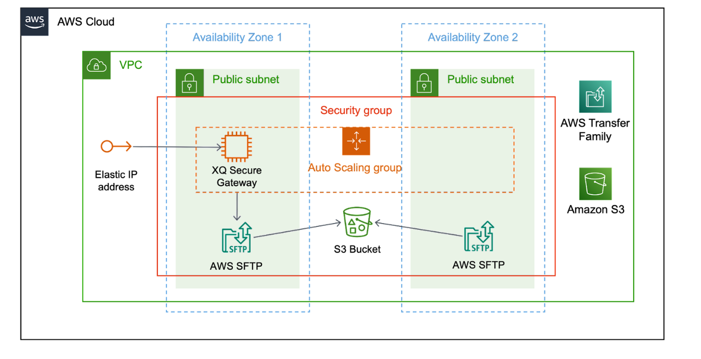

:xrefstyle: short

Deploying this Quick Start with default parameters builds the following {partner-product-short-name} environment in the
AWS Cloud.

[#architecture1]
.Quick Start architecture for {partner-product-short-name} on AWS

As shown in <<architecture1>>, this Quick Start sets up the following:

* A highly available architecture that spans two Availability Zones.
* A virtual private cloud (VPC) configured with public subnets, according to AWS best practices, to provide you with your own virtual network on AWS.
* An S3 bucket to store data transfered into AWS via the XQ Gateway.
* An Auto Scaling Group to allow the XQ Gateway to be restarted in a secondary AZ if needed.
* In the public subnets:
** An EC2 Instance running the XQ Gateway software.
** An Elastic IP address to provide a reserved public IP address to assign to the EC2 instance running the XQ Gateway.
** A Transfer Family Server to provide an SFTP interface to S3.
